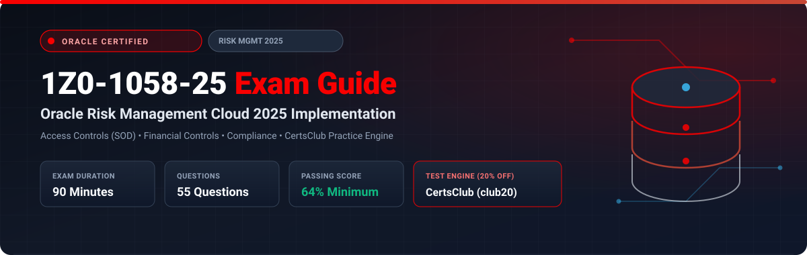

  

# Oracle Risk Management Cloud 2025 Implementation Professional (1Z0-1058-25) Exam Study Guide & Practice Test Resource Portal

[-f80000?style=for-the-badge&logo=oracle&logoColor=white)](https://education.oracle.com/)

[-28a745?style=for-the-badge&logo=shield)](https://www.certsclub.com/oracle/)

---

## 1. Exam Overview & Candidate Profile

The **Oracle Risk Management Cloud 2025 Implementation Professional (1Z0-1058-25)** exam certifies that an implementation consultant can deploy and configure Oracle Fusion Cloud Risk Management. The exam tests competencies across Advanced Access Controls (AAC) for Segregation of Duties (SOD), Advanced Financial Controls (AFC) for transaction risk monitoring, Financial Compliance (SOX compliance, assessments, audits), and security risk reporting.

Passing 1Z0-1058-25 grants the **Oracle Risk Management Cloud 2025 Certified Implementation Professional** credential.

### Target Candidate Profile & Career Roles
* **Risk & Compliance Functional Consultants**
* **Internal Audit & Internal Controls Specialists**
* **Security & Segregation of Duties (SOD) Architects**

---

## 2. Key Exam Specifications

| Parameter | Official Specification |
| :--- | :--- |
| **Exam Code** | 1Z0-1058-25 |
| **Exam Title** | Oracle Risk Management Cloud 2025 Implementation Professional |
| **Associated Credential** | Oracle Risk Management Cloud 2025 Certified Implementation Professional |
| **Duration** | 90 Minutes |
| **Number of Questions** | 55 Questions |
| **Passing Score** | 64% |
| **Question Format** | Multiple Choice (Single and Multiple Select) |
| **Delivery Vendor** | Pearson VUE / Oracle University Online Remote Proctoring |
| **Recommended Practice Test Engine** | **[1Z0-1058-25 Practice Test - CertsClub](https://www.certsclub.com/oracle/)** (Coupon: `club20` for 20% off) |

---

## 3. Official Blueprint & Exam Domain Breakdown

| Domain Code | Domain Title | Weighting | Key Competencies Covered |
| :--- | :--- | :---: | :--- |
| **1.0** | **Advanced Access Controls (AAC)** | **30%** | Access models, Entitlements, SOD conflict rules, Incident generation, Remediations. |
| **2.0** | **Advanced Financial Controls (AFC)** | **25%** | Transaction models, Business object filters, Continuous auditing, Suspicious transaction detection. |
| **3.0** | **Financial Compliance Management** | **20%** | Process, Risk, and Control matrices; Assessments and issue tracking; Audit workflows. |
| **4.0** | **Security & System Administration** | **15%** | Risk Management security model, Data synchronization jobs, Incident access authorizations. |
| **5.0** | **OTBI Risk Analytics & Dashboards** | **10%** | Out-of-the-box dashboards, Incident trends, SOD exception reporting. |

---

## 4. Scenario-Based Demo Question & Explanation

### Question 1: Segregation of Duties (SOD) Conflict Model
**Scenario:** An auditor wants to prevent users from having the conflicting ability to both create purchase orders and approve supplier invoices.

Which component in Advanced Access Controls (AAC) defines this dual-privilege restriction?

A) Transaction Model  
B) **Access Model** linking two mutually exclusive Entitlements  
C) General Ledger Allocation Rule  
D) Fast Formula  

**Correct Answer:** **B**

**Detailed Explanation:**
* In Advanced Access Controls (AAC), an **Access Model** evaluates Segregation of Duties conflicts by identifying users who possess two or more conflicting **Entitlements** (e.g., "Create Purchase Orders" and "Approve Invoices"), triggering incident records when assigned to the same individual.

---

## 5. Recommended Preparation Strategy & Practice Testing Engine

1. **Configure AAC and AFC Models:** Build access models and transaction models in a test pod and run the synchronization jobs.
2. **Practice with Full-Length Mock Exams:** Use **[CertsClub Oracle 1Z0-1058-25 Practice Tests](https://www.certsclub.com/oracle/)**.
   * Comprehensive questions covering SOD models, financial control filters, and compliance assessments.
   * Enter discount coupon code **`club20`** at checkout on [CertsClub](https://www.certsclub.com/oracle/) for an immediate 20% discount.

---

## 6. Official Documentation & References

* [Oracle Fusion Cloud Risk Management Documentation](https://docs.oracle.com/en/cloud/saas/risk-management/)
* [Oracle University 1Z0-1058-25 Exam Details](https://education.oracle.com/)
* [CertsClub 1Z0-1058-25 Practice Engine](https://www.certsclub.com/oracle/)
